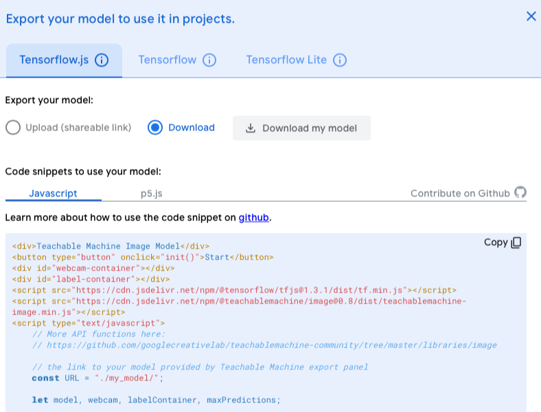

# Workshop international week

<br>

## About the lecturer

I'm [Erik Katerborg](https://www.linkedin.com/in/eerkmans/), and I teach Creative Media and Game Technologies at the Rotterdam University for Applied Sciences.

[View some of my work here](https://kokodoko.github.io).

---
<br>
<br>
<br>

## Workshop: Controlling a browser game with the webcam

In this workshop, you'll learn the following techniques:

- How to build a browser game with **plain HTML, CSS and Javascript custom elements**.
- How to build webcam detection with Teachable Machine.
- Integrating the webcam detector into the game.
---
<br>
<br>
<br>

## Preparation

To get started, download the zip file from this repository. Copy the files from the **start** folder into your own working directory.

⚠️ Then, open the `index.html` file via `http:localhost` in your browser.

If you don't have a `localhost` server, the simplest way to start one is by downloading and opening the [servez application](https://greggman.github.io/servez/) and clicking **start server**. Point servez to the folder that you are working in. Then open `http://localhost:8080` in your browser.

---
<br>
<br>
<br>

## Building a game with custom elements

- We are going to look at the three components of a PONG game: the main game file, the paddle file, and the ball file.
- The paddle and the ball are **custom elements**. This means that they behave as HTML tags that can execute code. 
- Let's add a few balls to the game by pasting `<ball-component>` and a `<paddle-component>` in the html body. 
- Introduction to `this.style.transform = translate()`
- Introduction to `requestAnimationFrame`
- The balls should now float around the screen, and the paddle should move with the cursor keys!
- Now we'll look at `game.js` and start adding a ball and the paddle from javascript. Remove the balls and paddle elements from the HTML file.
- We'll also move `requestAnimationFrame` to the `game.js` file so there is only *one loop* that updates the ball and paddle.
- The game checks the collision detection for the ball and the paddle! We should now have a working PONG game!
- Can you adjust the code so the ball doesn't bounce on the left wall? Instead, the ball should re-appear on the right after it exits the left side of the screen.

### Help

- [If you got stuck finishing the PONG game, you can look at the finished game files in `finished/game-finished`](./finished/game-finished/)
- [Documentation for custom elements](https://developer.mozilla.org/en-US/docs/Web/Web_Components/Using_custom_elements)

---
<br>
<br>
<br>

## Working with Teachable Machine

- Introduction to [Teachable Machine](https://teachablemachine.withgoogle.com/)
- Create a model with an "up", "down" and "neutral" gesture for the game.

---
<br>
<br>
<br>

## Download and test the Teachable Machine model

- Click **export model** to download the model (the *tensorflow.js version*) and place it in a `model` directory.
- Copy>paste the example HTML code from the model export window into a separate `webcamtest.html` file. 
- Open `webcamtest.html` in `localhost` to see if your webcam detection still works.


*Teachable Machine export window*

---
<br>
<br>
<br>

## Integrating the webcam detection into the game

The last step is to "tie" the detected gestures to the movement of the paddle! But first we need to load the tensorflow library into the pong game.

> 😱 This is a complex part! If you get stuck, take a peek at the [finished workshop files.]((./finished/game-gestures-finished/))

- Put the two tensorflow `<script>` tags from `webcamtest.html` in the head of your game's **index.html** page
- Create a separate `webcam.js` file and paste the inline javascript code from `webcamtest.html` in there.
- Load `webcam.js` in your game's **index.html** page with a `<script>` tag.
- ⚠️ Remove the `new Game()` line from `game.js`. Put it at the end of the `init()` function in `webcam.js`. Just to be sure the game starts when everything else is ready.
- See if the webcam detection runs on top of your game!

---
<br>
<br>
<br>

## Using the prediction

The `predict()` function in `webcam.js` returns a prediction for each label you created in Teachable Machine. You could log them by:

```javascript
    const prediction = await model.predict(webcam.canvas)

    if (prediction[0].probability > 0.8) {
        console.log("GO UP!!")
    } else if (prediction[1].probability > 0.8) {
        console.log("GO DOWN!!")
    }
```

- To use the prediction in the paddle, first create a global `up` and `down` variable in `webcam.js`. Set them to **true** if the `prediction` for up or down reaches a high `probability`.
- 🎮 Finally, check those global variables in `paddle.js`. If they are true, give the paddle a speed in that direction!
- If you want, you can remove the code that adds the webcam to the HTML document (you still need the webcam, but the player doesn't have to see it).

<br>
<br>
<br>

# Finished files

[You can find the finished game with gesture recognition here.](./finished/game-gestures-finished/)